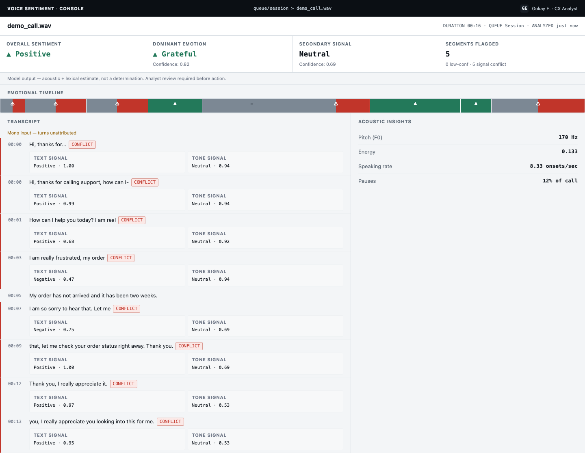

# AI Voice Sentiment Analyzer

A post-call analysis tool that determines sentiment and emotion **from the
spoken audio itself** — not just the transcript. A customer saying "okay,
that's fine" in a flat, clipped tone can read as neutral-to-positive in text
while the acoustic signal (pitch, pace, energy, pauses) carries something
very different. This project treats the voice signal as first-class
evidence: acoustic analysis and transcript/NLP analysis are fused into one
sentiment and emotion assessment, surfaced with confidence — not asserted as
flat fact — so a QA/CX analyst can review calls faster without losing the
tone-carried risk a transcript-only tool would miss.

Built as a portfolio project to demonstrate depth across audio processing,
speech emotion recognition, speech-to-text, NLP sentiment analysis,
multimodal fusion, and confidence/uncertainty handling — end to end, not as
token inclusion.

**Status: MVP complete** — all 3 planned epics shipped and verified (see
[`_bmad-output/implementation-artifacts/mvp-verification-2026-08-17.md`](_bmad-output/implementation-artifacts/mvp-verification-2026-08-17.md)).

## Screenshots

| Upload & session queue | Analysis Dashboard |
|---|---|
|  |  |

| Empty state | Delete confirmation |
|---|---|
|  |  |

The Analysis Dashboard shows overall sentiment, dominant emotion, a
secondary (lexical) signal, an emotional timeline, a full transcript with
per-turn text-vs-tone signal breakdown and disagreement flagging, and
acoustic insights (pitch, energy, speaking rate, pauses) — every reading
carries a confidence value, never a bare label.

## How it works

A call moves through five async pipeline stages (FastAPI hands off to an
RQ-queued worker, so upload returns immediately):

1. **Ingest** — channel detection (mono/stereo) + voice-activity chunking
2. **Acoustic** — speech emotion recognition on the raw audio (wav2vec2-based classifier)
3. **Transcript** — speech-to-text (faster-whisper) + optional speaker diarization
4. **Text sentiment** — NLP sentiment/emotion on the transcript
5. **Fusion** — combines acoustic + text signals into one calibrated result per segment, flagging cross-modal disagreement and low-confidence segments rather than hiding them

Speaker attribution works two ways: direct channel-splitting for stereo
recordings, or `pyannote.audio`-based diarization for mono recordings (needs
an `HF_TOKEN`, see below) — and degrades explicitly to "attribution
unavailable" rather than guessing when it can't produce a confident split.

Full technical rationale and every binding architecture decision lives in
[`_bmad-output/planning-artifacts/architecture/architecture-AIVoiceSentimentAnalyzer_v1-2026-08-10/ARCHITECTURE-SPINE.md`](_bmad-output/planning-artifacts/architecture/architecture-AIVoiceSentimentAnalyzer_v1-2026-08-10/ARCHITECTURE-SPINE.md).

## Known limitations

This is a dev/demo-scoped portfolio project (see the architecture doc's
AD-12), not a production call-center product. Known, deliberately accepted
gaps:

- **No persistence or auth.** The call list is session-scoped in the
  browser's memory; nothing survives a page reload, by design.
- **Mono diarization needs `HF_TOKEN`.** Without it, mono calls still
  process fully, just without a per-speaker breakdown.
- **No real-browser accessibility validation.** Automated tests run under
  jsdom; focus-ring rendering, 200% zoom reflow, and responsive-breakpoint
  behavior have not been manually verified in a real browser.
- **No schema migration tooling.** Schema changes rely on
  `CREATE TABLE IF NOT EXISTS`, which doesn't retrofit an existing local DB
  — delete `storage/app.db` after pulling a schema-changing update.
- **A job that exceeds its processing timeout under heavy host CPU
  contention can leave a Call stuck in `processing` permanently** — no
  reconciliation sweep exists yet to catch and fail stale jobs.
- **`ml-service` has no native (non-Docker) dev path on Intel macOS** — the
  pinned PyTorch version publishes no `x86_64` macOS wheel. Docker is the
  supported path on that platform.

Full rationale and the complete, actively-maintained list lives in
[`_bmad-output/implementation-artifacts/deferred-work.md`](_bmad-output/implementation-artifacts/deferred-work.md).

## Tech stack

- **Backend API:** FastAPI (`web-api/`)
- **ML/audio service:** consolidated pipeline worker — PyTorch, faster-whisper, pyannote.audio, transformers (`ml-service/`)
- **Frontend:** React 19 + TypeScript + Vite (`frontend/`)
- **Queue:** Redis + RQ
- **Storage:** SQLite (dev/demo scope — see architecture doc's AD-12)

## Quick start

```bash
git clone <this-repo>
cd AIVoiceSentimentAnalyzer_v1
docker compose up --build
```

- Frontend: http://localhost:3000
- Backend API docs: http://localhost:8000/docs

Optional: set `HF_TOKEN` (a Hugging Face access token with access to
`pyannote/speaker-diarization-community-1`) in your environment before
`docker compose up` to enable mono-call speaker diarization. Without it,
mono calls still process fully — just without a per-speaker breakdown.

## Development

Each service has its own tests and lint config:

```bash
# web-api / ml-service (Python)
cd web-api  && pip install -e ".[dev]" && ruff check . && pytest
cd ml-service && pip install -e ".[dev]" && ruff check . && pytest

# frontend
cd frontend && npm ci && npm run lint && npm test && npm run build
```

`ml-service` has no native (non-Docker) install path on Intel macOS — PyTorch
publishes no `x86_64` macOS wheel for the pinned version. Docker is the
supported path on that platform.

## Project structure

```
web-api/      FastAPI app — Call CRUD, status, timeline/transcript endpoints
ml-service/   Pipeline worker — ingest/acoustic/transcript/fusion stages
frontend/     React console — session call list + Analysis Dashboard
storage/      Runtime audio + SQLite DB (gitignored, session-scoped)
_bmad*/       Full planning + implementation trail (brief, PRD, UX,
              architecture, epics/stories, retrospectives) — this project
              was built with the BMad Method; these docs are the record of
              that process, not just output artifacts.
```

## License

MIT — see [LICENSE](LICENSE).
