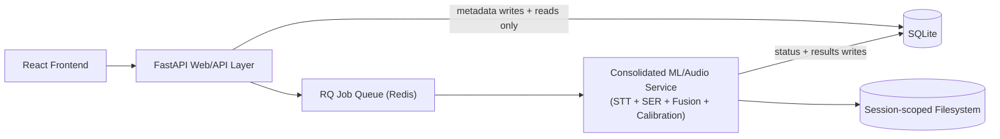
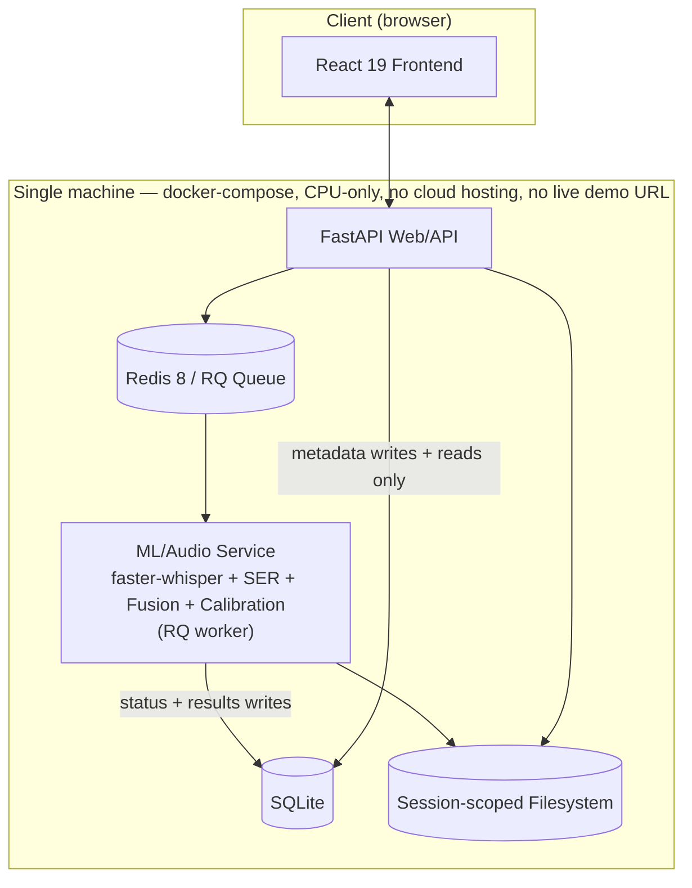
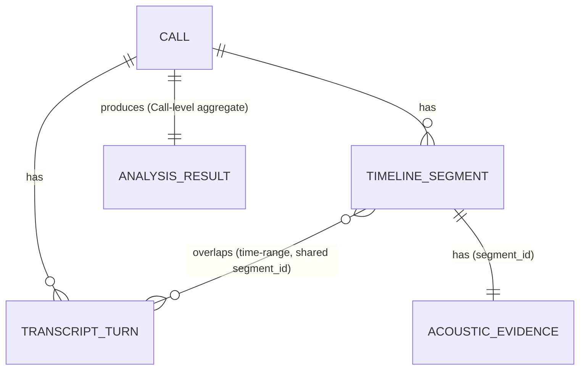

# Architecture Spine — AI Voice Sentiment Analyzer

## Design Paradigm

**Pipes-and-filters.** The core system is a multi-stage transformation chain over a single Call:

`audio ingest → VAD / chunk-boundary detection → parallel filters (acoustic-analysis filter, transcript-analysis filter) → fusion filter → confidence/calibration filter → stored Analysis Result`

Each stage consumes the previous stage's output and produces a well-defined artifact for the next; stages do not reach around each other. This maps to `ml-service/pipeline/{ingest, vad, acoustic, transcript, fusion, calibration}` (see Structural Seed).

The web layer (FastAPI + React) is a conventional consumer/adapter that sits in front of this pipeline — it triggers pipeline runs, polls their status, and renders their stored output. It is not a second paradigm; it does not itself transform audio/text signal.

## Invariants & Rules

### AD-1 — Voice-first: acoustic analysis can never be bypassed

- **Binds:** FR-4 (acoustic feature extraction), FR-5 (SER classification), FR-7 (transcript analysis stays a contributing signal, never a pre-emptive final answer)
- **Prevents:** One unit of the pipeline (or a future shortcut/fallback path) silently degrading a Call to transcript-only sentiment when the acoustic path is slow, unavailable, or fails — producing a result indistinguishable from a real voice-first analysis.
- **Rule:**
  - The acoustic-analysis filter is mandatory and must run to completion for every accepted Call; if it fails or is skipped, the Call's processing status is `failed` (AD-13) — there is no acoustic-skip fallback path.
  - The transcript-analysis filter's failure does not fail the Call: per FR-4, acoustic analysis produces output independently of transcript success, so fusion (AD-8) may proceed on the acoustic-emotion signal alone, with the resulting Sentiment/Emotion explicitly flagged as transcript-unavailable/single-modality rather than presented as an ordinary fused result.
  - No code path may ever substitute a transcript-only signal for a missing or failed acoustic signal.
  - A clean exit is not sufficient: the acoustic filter must itself raise a job failure (not merely return) whenever its own output falls below a defined sanity floor on its calibrated confidence (AD-9) — a technically-non-crashing but degenerate/low-confidence acoustic result must be flagged via that mechanism, not silently passed downstream as if it were a valid voice-first analysis.

### AD-2 — Audio input channel detection & speaker attribution

- **Binds:** FR-16 (best-effort speaker attribution)
- **Prevents:** Two independently-built ingest paths choosing different speaker-attribution strategies (e.g., one always diarizing, one always assuming single-speaker), producing inconsistent speaker data across Calls.
- **Rule:** At ingest, detect channel count. Stereo input → speaker identity is assigned deterministically by channel index; no diarization model runs. Mono input → a diarization model (AD-6) must run to attribute speakers. No path may skip speaker attribution and silently label all speech as one undifferentiated speaker. Regardless of path, the speaker identity exposed to the API/UI is a canonical generic label (e.g. "Speaker A"/"Speaker B"); the path-specific provenance (stereo channel index or mono diarization cluster id) is stored as separate internal metadata, never as the display-facing label itself — so stereo and mono Calls produce consistent speaker-label value shapes.

### AD-3 — SER classifier: embedding model + mandatory handcrafted-feature explainability layer

- **Binds:** FR-5 (SER classification), FR-13 (evidence drill-down)
- **Prevents:** A future SER implementation treating handcrafted acoustic features (pitch/F0, energy, speaking rate, pauses) as optional debug output rather than required evidence, breaking the acoustic-metric-bar UI's data contract.
- **Rule:** The SER stage's primary classifier is an embedding-based model (Wav2Vec2/HuBERT/WavLM-family fine-tune). Independently of classifier internals, the stage must also compute and persist a handcrafted acoustic-feature set (pitch/F0, energy, speaking rate, pauses/voice-activity) as a separate, mandatory explainability output for every Call — never conditional, never debug-only. The handcrafted-feature library must be license-safe for redistribution: librosa/torchaudio-based extraction, not openSMILE/eGeMAPS (research-only license, blocks commercial use) or Praat/parselmouth (GPLv3 copyleft, distribution obligations) — per Technical Research §3.2's explicit rejection of both as default dependencies. This handcrafted-feature set is persisted as a segment-linked entity — one `ACOUSTIC_EVIDENCE` row per `TimelineSegment`, keyed by `segment_id` (see Core-entity sketch) — never a single Call-level blob.

### AD-4 — Emotion taxonomy: coarse categories mapped to polarity colors

- **Binds:** FR-5 (SER classification), FR-9 (timeline)
- **Prevents:** The model layer and the UI layer independently inventing incompatible Emotion label sets, or a future change collapsing Emotion directly onto the 4-value Sentiment polarity scale and losing the richer per-emotion evidence EXPERIENCE.md requires.
- **Rule:** Emotion is a small coarse category set (CREMA-D-style, 4-6 classes). Every Emotion category must map through one fixed lookup table to exactly one of the four Sentiment polarity colors (negative/mixed/positive/neutral). Adding an Emotion category requires extending this lookup table in the same change. Emotion must never be collapsed onto the polarity scale at generation time (see AD-15).

### AD-5 — STT engine: faster-whisper

- **Binds:** FR-4 (transcript extraction), FR-13 (evidence drill-down), NFR-1 (evidence linkage)
- **Prevents:** A future component depending on a different STT engine's output shape/timestamp semantics, breaking evidence-linkage.
- **Rule:** Speech-to-text runs via faster-whisper (CTranslate2-based, local), producing word-level timestamps for every transcript turn. No alternate STT engine may be substituted without amending this AD.

### AD-6 — Diarization: WhisperX + pyannote.audio 4.0 Community-1 (mono path only)

- **Binds:** FR-16 (speaker attribution), AD-2
- **Prevents:** A future dependency bump silently pulling in pyannote's commercial precision-2 tier (or any paid-license pyannote tier), or diarization logic leaking into the stereo path where it doesn't belong. Also prevents a diarization failure from being silently swallowed or misrepresented as a confident per-turn reading.
- **Rule:** Mono-path diarization is performed by WhisperX orchestrating faster-whisper transcription, forced alignment, and pyannote.audio's 4.0 Community-1 pipeline (CC-BY-4.0, HF-gated). The commercial precision-2 tier, or any tier requiring a paid license, must never be used. Stereo input never invokes WhisperX or diarization. Diarization confidence is expected to be systematically lower during overlapping/emotionally-charged speech — exactly the turns this product cares about most (Technical Research §5.4) — so per-turn confidence (AD-10) must be captured, not discarded. Two distinct failure states must be representable, not conflated: if diarization produces no usable speaker split for the Call at all, the whole Call gets a Call-level "attribution unavailable" state (still a full Analysis Result per FR-16, just without a per-speaker breakdown); if diarization succeeds overall but a specific turn's speaker label is low-confidence, that turn gets the per-turn "uncertain" state (AD-10) while the rest of the Call's attribution stands.

- **[SUPERSEDED IN PART — implementation deviation, confirmed with user, recorded 2026-08-17 via Epic 3 retrospective]:** The "WhisperX orchestrating..." clause above is no longer implemented as written. At Story 3.2 implementation time, every `whisperx` release supporting pyannote.audio's Community-1 tier (3.8.0+) requires `torch~=2.8.0`, which conflicts with this project's Stack-pinned `torch==2.13.0` (already load-bearing for Stories 1.3-1.5's shipped pipeline stages); no `whisperx` release satisfies both constraints. Presented to the user as a three-way choice — (a) use whisperx 3.7.0, verified to silently downgrade to pyannote's non-Community-1 `speaker-diarization-3.1` model, violating this AD's own tier requirement; (b) downgrade `torch`/`transformers` project-wide, rejected as disproportionate blast radius against already-shipped, tested pipeline stages; (c) drop `whisperx`, call `pyannote.audio.Pipeline` directly — chosen.
  - **What changed:** `ml-service/app/pipeline/transcript/diarize.py` calls `pyannote.audio.Pipeline.from_pretrained("pyannote/speaker-diarization-community-1", ...)` directly and implements its own word-to-speaker time-overlap lookup (mirroring `fusion/overlap.py`'s existing pattern), instead of WhisperX's `assign_word_speakers`. WhisperX's forced-realignment step (`align()`) is skipped entirely; word-to-speaker attribution relies on faster-whisper's own already-persisted word-level timestamps (Story 1.4, AD-5) rather than a second, WhisperX-driven alignment pass. `whisperx` is no longer a project dependency (removed from `ml-service/pyproject.toml`).
  - **What did not change:** the pinned diarization model/tier (`pyannote/speaker-diarization-community-1`, CC-BY-4.0, HF-gated) — this AD's core "never the paid precision-2 tier" prohibition is fully intact and enforced (model id hardcoded, never configurable). Every other clause of this AD (mono-only, stereo never invokes it, per-turn confidence captured via a word-agreement-ratio heuristic — a dev-agent decision consistent with this AD's own "confidence should be lower for overlapping speech" expectation — and the two distinct failure-state requirement) is implemented as written and verified by Story 3.2/3.3's test suites.
  - **Capability impact assessed:** dropping forced re-alignment removes a secondary, WhisperX-internal timestamp-refinement pass. No FR, AC, or other AD in this document requires that refinement specifically — AD-5 requires only word-level timestamps from the STT engine, which faster-whisper already provides directly; no UX or PRD document names alignment precision as a requirement. Reviewed against FR-16, AD-2, AD-5, AD-10, and NFR-1 (explainability/evidence-linkage): none are violated. Any residual word/speaker-boundary imprecision from skipping re-alignment is expected to surface as a lower word-agreement-ratio confidence value (i.e. becomes visible as reduced confidence, not silently wrong high-confidence attribution) — consistent with this AD's own design intent.
  - **Stack table:** the `WhisperX` row below is retained for historical/planning traceability but is no longer an active project dependency as of Story 3.2.

### AD-7 — Model serving boundary: one consolidated ML/audio service

- **Binds:** all pipeline capabilities (FR-4 through FR-11); FR-3 (async status)
- **Prevents:** The pipeline fragmenting into independently-deployed microservices (e.g., a separate STT service and SER service) that drift in versioning, or the web/API layer embedding pipeline code in-process and bypassing the job queue.
- **Rule:** STT, SER, and fusion live in one consolidated Python ML/audio service (clean internal module separation, single deployment boundary) — not network-separated microservices. This service is architecturally distinct from the web/API layer. The web/API layer must never import or call pipeline code in-process; the ML/audio service must never be reachable directly from the frontend. All analysis work crosses this boundary exclusively via the job queue:



### AD-8 — Fusion mechanism: rule-based, confidence-weighted, explicit disagreement flag

- **Binds:** FR-8 (fusion), FR-11 (dual-signal disagreement display)
- **Prevents:** A future iteration replacing rule-based fusion with a trained black-box fusion model (no jointly-labeled multimodal call-center dataset exists to validate one), or silently averaging away a genuine cross-modal disagreement into one number.
- **Rule:**
  - Fusion executes once per `TimelineSegment`, not once per Call: every `TimelineSegment` row carries its own fused Sentiment + Emotion + confidence + disagreement flag + speaker-attribution confidence (AD-9/AD-10). `ANALYSIS_RESULT` never runs an independent fusion pass — it is the Call-level aggregate, a deterministic reduction over the Call's `TimelineSegment` rows: overall Sentiment/Emotion is the confidence-weighted mean across segments, and Segments Flagged is the count of segments with the disagreement flag set (see Core-entity sketch).
  - The per-segment fusion step is rule-based: confidence-weighted averaging of the two calibrated modality signals. A trained fusion model must never replace this step.
  - When the two modalities disagree in polarity and both exceed a configurable confidence floor, fusion must set an explicit per-segment disagreement flag on that `TimelineSegment` and preserve both signals for the dual-signal panel (FR-11) — never collapse a genuine disagreement into a single blended value.
  - When the text-sentiment signal is unavailable (transcript analysis failed, per AD-1), fusion outputs the acoustic-emotion signal alone with a single-modality flag — a distinct, explicitly labeled state, never presented as an ordinary two-signal fusion result.
  - Fusion must always retain the non-dominant (lower-weighted) modality's reading, not just discard it once the dominant one is chosen — this is the per-Call "Secondary Signal" EXPERIENCE.md's Summary cells require, computed as part of the `ANALYSIS_RESULT` aggregate (separate from the per-segment disagreement flag above) and exposed with a "None flagged" fallback when no distinct-enough secondary reading exists.

### AD-9 — Confidence/uncertainty generation: temperature scaling only for MVP

- **Binds:** FR-10 (confidence + threshold), FR-14 (low-confidence flagging)
- **Prevents:** A future component reporting a modality's raw, uncalibrated softmax score as if it were a trustworthy confidence value; also prevents adopting a theoretically-shaky uncertainty method (see Rule) under the mistaken belief that the batch/async architecture removes all objections to it.
- **Rule:** Every modality's native softmax confidence must be calibrated via temperature scaling before use — this is the sole required MVP calibration mechanism. Modality disagreement itself (AD-8) is the fusion stage's uncertainty signal; no additional per-modality uncertainty-estimation technique is required for MVP. MC Dropout and ensemble-disagreement methods are explicitly *not* adopted for MVP — Technical Research §6.4 rejects both as primary MVP methods (MC Dropout's induced posterior doesn't match a proper Bayesian posterior; mixed empirical benefit) and recommends them only as stretch goals (see Deferred).

### AD-10 — Two independent confidence axes must never be conflated

- **Binds:** FR-10, FR-14, FR-16
- **Prevents:** A future data model or API response merging Sentiment/Emotion confidence and speaker-attribution confidence into one composite score, making it impossible to show "confident sentiment, uncertain speaker attribution" as EXPERIENCE.md's state patterns require.
- **Rule:** Sentiment/Emotion confidence (from calibrated fusion, AD-9) and speaker-attribution/diarization confidence (from pyannote, mono path only — see AD-6's deviation record for why this is pyannote-direct rather than WhisperX-orchestrated) are stored, computed, and surfaced as two separate fields at every layer — data model, API, UI. No code may combine them into a single score. On `TranscriptTurn` and `TimelineSegment` records specifically, both fields must be co-present on the same row (not merely reachable via a join) — EXPERIENCE.md's State Patterns require a confident Sentiment/Emotion reading and an uncertain speaker-attribution reading to be legible together on one turn.

### AD-11 — Chunking/timeline unification: one VAD boundary set, two consumers

- **Binds:** FR-9 (Emotional Timeline)
- **Prevents:** A future implementation computing timeline segment boundaries independently from model-input chunk boundaries, letting the two silently drift apart.
- **Rule:** VAD-detected speech boundaries are the single source of chunk boundaries. The same boundaries used for STT/SER model-input chunking (a technical necessity) must be reused, unmodified, as the Emotional Timeline's segment boundaries. No second, independently-computed timeline-boundary set may exist. Rolling context must be carried across chunk boundaries so per-chunk analysis is not artificially discontinuous. `TranscriptTurn` boundaries (speaker-utterance-based, from diarization/STT) are never clipped or re-split to force a 1:1 fit with `TimelineSegment` boundaries: each `TranscriptTurn` is associated with every `TimelineSegment` whose time range overlaps it — a many-to-many relationship via time-range overlap, not a single scalar `segment_id` foreign key on `TranscriptTurn`.

### AD-12 — Storage boundary: SQLite + session-scoped filesystem

- **Binds:** FR-3 (status), FR-12 (full result), FR-13 (evidence), PRD §10 (retention posture)
- **Prevents:** A future component persisting Call data to a third-party service, or treating local storage as a durable, permanent-retention guarantee it isn't meant to be.
- **Rule:** Structured Analysis Results, Call metadata, and processing status live in SQLite; uploaded audio and intermediate artifacts live in a session-scoped local filesystem directory. All of it must remain deletable by the user/session and must never be transmitted to any third-party service. This persistence exists for dev/demo resilience only — it is not a product promise of durable storage. Delete is an explicit, atomic operation: a single delete action must remove a Call's SQLite rows (Call, AnalysisResult, TranscriptTurn, TimelineSegment) and its filesystem artifacts (audio, intermediates) together — never one without the other — and completes immediately, matching EXPERIENCE.md's confirm-dialog copy ("immediate and unrecoverable"). A delete request for a Call with an in-flight (queued or processing) RQ job must first cancel or await that job's completion before removing the Call's rows and artifacts — delete must never race a live job's writes. Demo/training audio must be synthetic, self-recorded, or explicitly consented — never real customer call recordings — per Technical Research §12.4's GDPR/KVKK biometric-data risk guidance.

### AD-13 — Async orchestration: RQ + Redis job queue

- **Binds:** FR-3 (queued/processing/complete/failed status, non-blocking behavior, retry)
- **Prevents:** The web/API layer blocking a request thread on analysis work, or a future implementation swapping in in-process background tasks (asyncio/BackgroundTasks) that lose status on a web-process restart.
- **Rule:** All Call-processing work is dispatched as an RQ job on a Redis broker. The web/API layer enqueues on upload and never performs analysis itself. Status transitions (queued/processing/complete/failed) are driven by the queue/worker lifecycle, not by ad hoc state written from the web process. Only the ML/audio service's RQ worker process writes `Call.status` transitions (at job start, completion, and failure) — the web/API process never writes `Call.status`; its own database writes are limited to Call/upload metadata at ingest time. `API --> DB` in the container diagram is a metadata-write and status/results-read path only, never a status-write path. Redis is the pinned broker for this Stack; Valkey (RQ 2.10+ supports both) is an acceptable drop-in substitute if ever swapped, not a forbidden option.

### AD-14 — Local-only inference: no cloud SER/STT API dependency [ADOPTED]

- **Binds:** FR-4, FR-5 (acoustic pipeline); FR-4 (transcript pipeline); PRD §10 (no third-party audio egress)
- **Prevents:** A future integration routing audio or transcript to a cloud SER/STT API for convenience or cost reasons, breaking the local-only/no-third-party-egress posture.
- **Rule:** No pipeline stage may call a cloud SER or cloud STT API; all SER and STT inference runs locally against open-weight models. **[ADOPTED]** for SER: not an elicited choice — Technical Research §10.1 [RESEARCH FINDING] found no major cloud provider (Azure/AWS/Google) offers genuine acoustic voice-emotion inference as of Aug 2026 (cloud "sentiment" APIs operate on transcript text only, so no cloud path exists for acoustic SER specifically); Hume AI's dedicated acoustic-emotion API being sunset (last run date June 14 2026) is separately [VERIFIED]. STT's local-only requirement is a separately elicited decision (data-retention consistency, cost, portfolio technical-depth), not a landscape fact.

### AD-15 — Data contract discipline: Emotion and Sentiment are separately-addressable fields

- **Binds:** FR-5, NFR-3
- **Prevents:** A future change merging Emotion and Sentiment into one composite label/field at generation time, which would make FR-9's timeline glyphs and FR-11's dual-signal panel unable to address them independently.
- **Rule:** Sentiment and Emotion remain distinct fields end-to-end — in the ML service's output, the job payload, the SQLite schema, and the API response. Fusion output must carry a Sentiment value + confidence and an Emotion value + confidence side by side; no code may merge them into one composite field at generation time.

### AD-16 — Human-in-the-loop: no autonomous final verdicts

- **Binds:** FR-13 (evidence drill-down), FR-14 (low-confidence flagging), FR-15 (no-certainty language), NFR-4 (human-in-the-loop framing)
- **Prevents:** A future API response or UI surface presenting a Sentiment/Emotion value as settled fact without its confidence and evidence, letting an analyst act on an unqualified number.
- **Rule:** The system never emits a result presented as an autonomous, certain final verdict. Every Analysis Result returned to the Analyst must be confidence-qualified and evidence-linked (traceable to a timeline segment, transcript span, and acoustic evidence). No API response or UI surface may show a Sentiment/Emotion value without its accompanying confidence and evidence linkage.

### AD-17 — Evaluation strategy: baseline-first validation

- **Binds:** NFR-2, NFR-5 (no unproven accuracy/calibration claims)
- **Prevents:** A future report crediting fusion (or the SER model generally) with an accuracy benefit without having first ruled out that a trivial baseline explains the same result, or presenting a public-benchmark number as this system's real-world accuracy.
- **Rule:** Any accuracy/performance claim about the SER or fusion pipeline must be established against a majority-class baseline first, then single-modality baselines, before crediting fusion with any benefit. Public benchmark numbers (IEMOCAP/CREMA-D) must be labeled explicitly as optimistic upper bounds pending in-domain validation against a small manually-annotated in-domain validation set. UAR and macro-F1 are the headline metrics, given class imbalance.

### AD-18 — Deployment envelope: single machine, no cloud, CPU-only baseline

- **Binds:** all components; PRD §10 (no dedicated production infrastructure budget)
- **Prevents:** A future deployment change assuming GPU availability or provisioning cloud hosting, breaking the project's explicit no-infra-budget constraint and its "no live public demo" presentation plan.
- **Rule:** The system deploys as a single-machine docker-compose stack (web/API, frontend build, ML/audio service + RQ worker, Redis, SQLite + filesystem volume). CPU-only inference is the baseline target — no component may assume GPU availability. There is no cloud hosting target and no live public demo URL as part of this architecture.

### AD-19 — Text-sentiment classifier: fine-tuned/pretrained transformer

- **Binds:** FR-7 (transcript Sentiment/Emotion/keyword analysis)
- **Prevents:** The transcript-analysis stage becoming an unversioned, opaque dependency (e.g. an ad hoc LLM prompt) that resists the same explainability/evaluation discipline applied to the acoustic path — and specifically prevents the pipeline drifting toward the Product Brief's named anti-pattern ("audio → STT → LLM → sentiment" with acoustic features as decoration), even in a fully local form.
- **Rule:** Transcript Sentiment/Emotion is produced by a small, fine-tuned or pretrained transformer classifier (RoBERTa/DistilBERT-family), not a general-purpose LLM and not a cloud API (consistent with AD-14/AD-18's local/CPU-only posture). This keeps the text-analysis path symmetric with AD-3's SER approach: a controllable, explainable classifier whose output feeds fusion (AD-8) as one of the two required signals — never a pre-emptive answer (AD-1).

### AD-20 — Audio ingest constraints: format, duration, size

- **Binds:** FR-1 (upload validation), FR-2 (accepted formats/limits)
- **Prevents:** Two independently-built ingest paths (e.g. a future bulk-upload feature vs. the original single-upload endpoint) enforcing different format/size rules and producing inconsistent acceptance behavior.
- **Rule:** Accepted audio formats are WAV, MP3, and M4A only. Maximum duration is 30 minutes; maximum file size is 200MB. Files outside these bounds, or that fail decode validation, are rejected at ingest with a structured, rule-identifying error (per the Consistency Conventions' validation-error-shape row) — never a generic validation failure.

### AD-21 — CI, testing, and logging baseline

- **Binds:** all components (cross-cutting)
- **Prevents:** This dimension being silently unaddressed — pipeline stages, or the web/API and ML/audio services, independently adopting inconsistent (or absent) test coverage and logging practices with no shared baseline to converge on.
- **Rule:** Each pipeline stage (ingest, acoustic, transcript, fusion, calibration) has its own unit tests, runnable independently, reflecting the pipes-and-filters stage boundaries (AD-7). A GitHub Actions workflow runs tests and lint on every push — no deployment step, since AD-18 defines no live hosting target. Both `web-api` and `ml-service` emit structured JSON logs; no metrics/monitoring stack is required, as that would be disproportionate to the single-machine deployment (AD-18).

## Consistency Conventions

| Concern | Convention |
| --- | --- |
| Naming (entities, files, interfaces, events) | Reuse PRD Glossary terms in code/schema/API wherever the concept matches directly: `Call`, `Analyst`, `TranscriptTurn`, `AnalysisResult`. `TimelineSegment` implements the Glossary's `Emotional Timeline` concept (a timeline is the ordered collection of its segments; the entity itself is intentionally not renamed `EmotionalTimelineSegment`). `Sentiment` and `Emotion` are always named and stored as distinct fields/properties (never `emotionSentiment` or similar merged names) per AD-15. |
| Data & formats (ids, dates, error shapes, envelopes) | Confidence values are calibrated floats in `[0, 1]`; any confidence that crosses a flagging threshold is paired with a `flag_reason` string — never a bare float on a flagged item. In-audio timestamps are float seconds relative to Call start (native faster-whisper word-timestamp unit); record-level timestamps (created/updated) are ISO 8601 UTC. Evidence-linkage uses a shared `segment_id` (from AD-11's VAD boundaries) as the join key for FR-13/NFR-1 drill-down — see AD-11 for the TranscriptTurn relationship and AD-3 for the ACOUSTIC_EVIDENCE link — not separate IDs per view. |
| State & cross-cutting (mutation, errors, logging, config, auth) | Call processing status is a state machine: `queued → processing → complete → failed` (FR-3), driven only by the RQ/Redis job lifecycle (AD-13). Upload/ingest validation failures (FR-2) return structured, rule-specific error objects (machine-readable error code + message per failed rule), not a generic validation error. Tunable thresholds — disagreement threshold, low-confidence threshold — live in config (env/config file), never hardcoded in pipeline code. |

## Stack

| Name | Version |
| --- | --- |
| Python | 3.13 (3.13.15) — mature current line; 3.12 is now security-fixes-only per PEP 693. Compatible with pyannote.audio 4.0 (requires 3.10+), transformers 5.14.1 (requires 3.10.0+), and torchaudio 2.11.0's supported classifier range (3.10-3.14) |
| FastAPI | 0.141.1 |
| React | 19.2.8 |
| faster-whisper | v1.2.1 (MIT — verify LICENSE file at implementation time; Technical Research flagged this as not independently confirmed) |
| WhisperX | 3.8.6 (pinned) — **no longer an active dependency as of Story 3.2; see AD-6's deviation record.** Retained here for historical/planning traceability only. |
| pyannote.audio | 4.0.7 (Community-1 pipeline, CC-BY-4.0, HF-gated) |
| transformers | v5.14.1 |
| PyTorch | 2.13 |
| librosa | 0.11.0 — handcrafted acoustic-feature extraction (AD-3) |
| torchaudio | 2.11.0 — confirmed compatible with PyTorch 2.13; handcrafted acoustic-feature extraction (AD-3) |
| RQ | 2.10.0 |
| Redis | 8.10 |
| SQLite | Python stdlib `sqlite3` |

## Structural Seed

### Container / deployment view



### Source tree sketch

```text
{root}/
  web-api/              # FastAPI app: upload/ingest endpoints, status polling, results API, SQLite access
  ml-service/            # Consolidated ML/audio service: STT, SER, fusion, calibration, RQ worker entrypoint
    pipeline/
      ingest/            # channel detection, VAD/chunk-boundary detection
      acoustic/           # SER classifier + handcrafted-feature explainability layer
      transcript/          # faster-whisper STT + pyannote diarization (mono path, direct — see AD-6 deviation record) + text-sentiment classifier
      fusion/               # rule-based fusion + disagreement flag + Secondary Signal
      calibration/           # temperature scaling
  frontend/              # React 19 app (DESIGN.md token system, EXPERIENCE.md state patterns)
  storage/                # session-scoped filesystem volume: uploaded audio + intermediate artifacts
  docker-compose.yml       # web-api + frontend + ml-service/worker + redis + volumes
```

### Core-entity sketch



`TIMELINE_SEGMENT` is segment-level detail; `ANALYSIS_RESULT` is the separate Call-level aggregate — the two are never the same authority for Sentiment/Emotion (rule: AD-8).

SQLite owns the real schema once code exists — this sketch fixes only names and relationships.

## Capability → Architecture Map

| Capability / Area | Lives in | Governed by |
| --- | --- | --- |
| FR-1 / FR-2 (upload validation) | `web-api` ingest endpoint | AD-20, Consistency Conventions — State & cross-cutting (structured validation errors) |
| FR-3 (status tracking) | RQ/Redis job states | AD-13 |
| FR-4 / FR-5 (acoustic-first, never bypassed) | `ml-service/pipeline` (acoustic filter) | AD-1, AD-3 |
| FR-6 (English-only) | `ml-service/pipeline/transcript` STT config | AD-5 (no localization branch in scope) |
| FR-7 (transcript Sentiment/Emotion analysis) | `ml-service/pipeline/transcript` | AD-19, AD-1 |
| FR-8 (fusion) | `ml-service/pipeline/fusion` | AD-8 |
| FR-9 (timeline) | `ml-service/pipeline/ingest` (VAD/chunking stage) | AD-11 |
| FR-10 (confidence + threshold) | `ml-service/pipeline/calibration` | AD-9, AD-10 |
| FR-11 (disagreement/dual-signal) | `ml-service/pipeline/fusion` disagreement rule | AD-8 |
| FR-12 / FR-13 (full result + evidence drill-down) | SQLite storage schema + evidence-linkage join | AD-12, Consistency Conventions — Data & formats (`segment_id`) |
| FR-14 / FR-15 (low-confidence flagging, no-certainty language) | `web-api` response contract | AD-16, AD-9 |
| FR-16 (best-effort speaker attribution) | `ml-service/pipeline/ingest` (channel detection) + `transcript` (diarization) | AD-2, AD-6 |
| §10 delete/retention | `web-api` delete endpoint, dual-store removal | AD-12 |
| NFR-1 (explainability/evidence-linkage) | ML pipeline evidence output + storage schema | AD-3, AD-12 |
| NFR-2 (confidence honesty / no unproven calibration claims) | Evaluation reporting methodology | AD-17 |
| NFR-3 (Emotion/Sentiment terminology discipline) | Data contract (schema/API field naming) | AD-15 |
| NFR-4 (human-in-the-loop framing) | API response contract + UI | AD-16 |
| NFR-5 (evaluation transparency) | Evaluation reporting methodology | AD-17 |
| Cross-cutting: CI, testing, logging | all components (`web-api`, `ml-service`) | AD-21 |

## Deferred

- **Exact chunk-length / VAD sensitivity parameters** — depends on empirical tuning against real chunked audio; AD-11 fixes the mechanism (one boundary set, two consumers), not the numbers.
- **Exact disagreement / low-confidence threshold numeric values** — evaluation-phase tuning; AD-8/AD-9 fix that these thresholds exist and are configurable, not their values.
- **Ensemble-disagreement and MC Dropout as a future uncertainty-signal upgrade** — Technical Research §6.4 names both as reasonable stretch goals despite rejecting them as MVP defaults (AD-9); worth revisiting post-MVP once the theoretical/engineering-cost tradeoffs are re-examined against real usage.
- **Exact final Emotion category list wording** — AD-4 fixes the taxonomy shape (coarse, CREMA-D-style, mapped to 4 polarity colors), not the final label set.
- **GPU-vs-CPU empirical validation** — Technical Research flagged CPU-only feasibility as plausible but unverified; AD-18 fixes CPU-only as the baseline target, actual throughput validation is implementation-time work.
- **Epic/story breakdown** — next BMAD phase; this spine intentionally stays at initiative altitude to keep features free.
- **Whether to ever add a live-hosted demo** — explicitly deferred; AD-18 fixes only that no live demo exists as part of this architecture today.
- **Turkish language support** — explicitly out of MVP scope per PRD FR-6.
- **Exact SQLite schema DDL** — code owns the real schema once written; the Structural Seed's core-entity sketch fixes only names and relationships.
